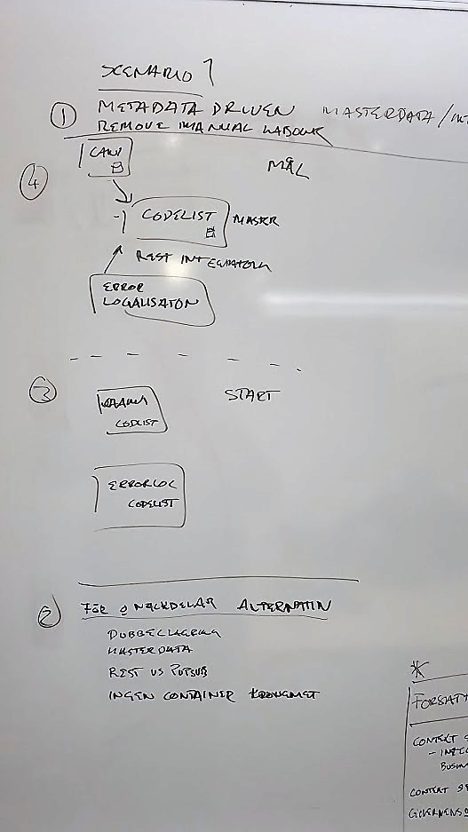

# ExampleServices

This repository is created to help developers and architects view examples of features applied into services. The scenarios describe different states your environment could be in, and examples how to gain a more recommended state using architecture described in CSPA.

## Scenario 1 - From disconnected services to connected metadata driven

### Starting point

We start with two services (CAWI, ErrorLog). The services or application do not know of each other, each has implemented its own implementation of code lists.

### Thought process

### Goal

To follow principle of metadata driven systems, we see that each of the two services needs to manage the same meta data. By extracting this function we can make each service be more accomodated towards single responsibility.

### Pros and Cons

Having a disconnected state of applications the manual labour to keep data up to date is high

## Description of services within code book

### StatisticalPrograms

Main objective of this service is to hold metadata regarding the statistical programs. It is the owner of this data.

### CAWI

The service is the web user interface to collect statistical data from the respondents

### Code Lists

Service for maintaining and setting up code lists

### Error Localizations

Service that runs validation on datasets

### Manual Editing

Used for users editing respondent data in need for revising