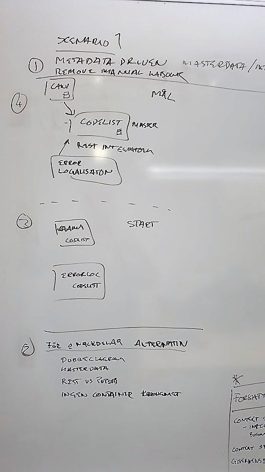
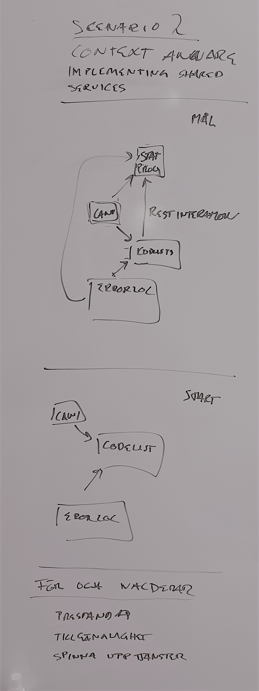
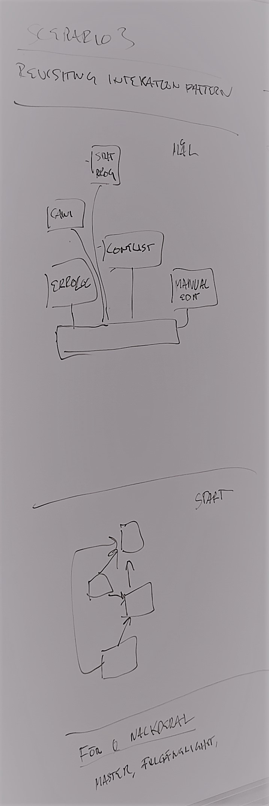
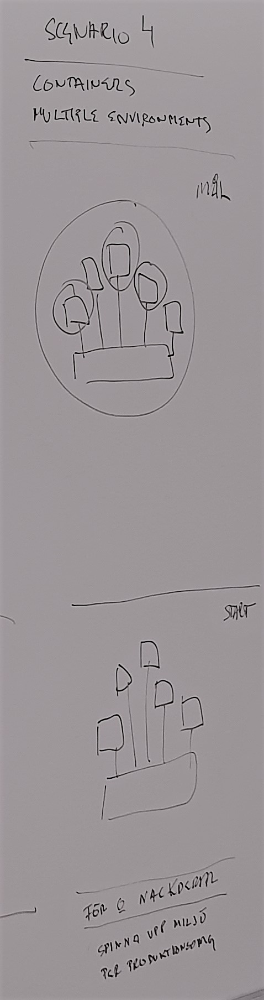
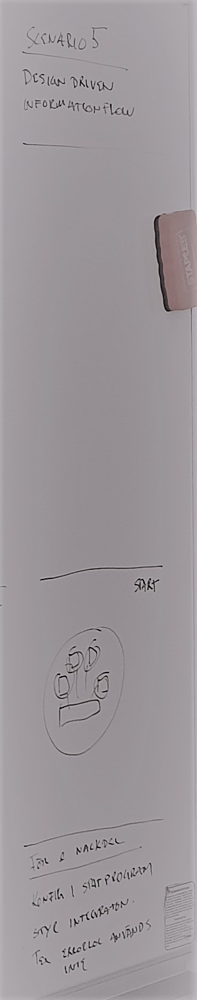

# ExampleServices

starting point, describe the repository, its purpose, how to view examples

This repository is created to help developers and architects view examples of features applied into services. The scenarios describe different states your environment could be in, and examples how to gain a more recommended state using architecture described in CSPA.

## Scenario 1 - From disconnected services to connected metadata driven

-todo, replace with graphics

### Starting point

We start with two services (CAWI, ErrorLocalization). The services or application do not know of each other, each has implemented its own implementation of code lists.

### Goals

To follow principle of metadata driven systems, we see that each of the two services needs to manage the same meta data. By extracting this function we can make each service be more accomodated towards single responsibility.

### Thought process

Taking small steps and adding value incrementally. Trying not to overreach in our examples we strafe for taking small logical steps to evolve our services. This is why in our examples might take tideous small steps in advancing the architecture of the system.

Pros and Cons; Having a disconnected state of applications the manual labour to keep data up to date is high

### Result

By extracting logic and 

## Scenario 2 - Context Aware

We have the three services CAWI, CodeList, and ErrorLoc but we have identified they use the same meta information in some regard. The dupication of information is therefore a fact. By making the services context aware we can extract logic regarding setting up dupicate meta information in the applications.

### Starting point

Three services; CAWI, CodeList and ErrorLoc

### Goal

By extracting a service for handling meta data regarding Statistical programs we can minimize the duplication of manual setup within each service.

## Scenario 3

## Scenario 4

## Scenario 5

###############################################

## Description of services within code book

### StatisticalPrograms

Main objective of this service is to hold metadata regarding the statistical programs. It is the owner of this data.

### CAWI

The service is the web user interface to collect statistical data from the respondents

### Code Lists

Service for maintaining and setting up code lists

### Error Localizations

Service that runs validation on datasets

### Manual Editing

Used for users editing respondent data in need for revising
