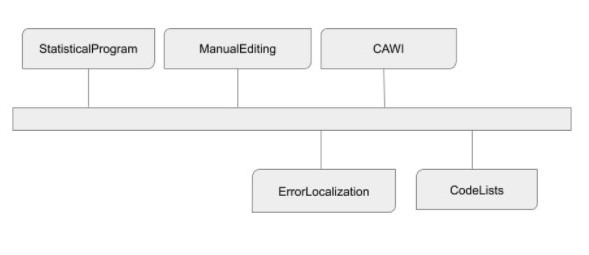
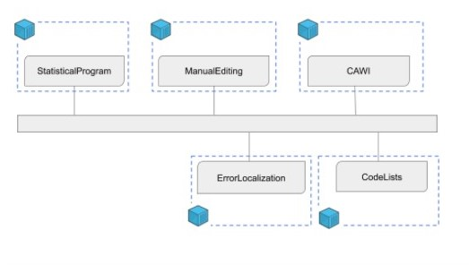

# Example Services

This repository is created to help developers and architects view examples of features applied into services. The scenarios describe different states your environment could be in, and examples how to gain a more recommended state using architecture described in CSPA.

Taking small steps and adding value incrementally. Trying not to overreach in our examples we strafe for taking small logical steps to evolve our services. This is why in our examples might take tideous small steps in advancing the architecture of the system.

## Development environment

Trying to mimic a real life scenario we have used different techniques and programming languages such as C#, Java and python. Each service will describe how to build and run it.

<!-- ## Scenarios

In each scenario we show a current state of a system, an identified flaw, and how we can amend this with a remodelling of the architecture.

The different scenarios are explained in [Scenarios.md](./Scenarios.md).

 -->

# Scenarios

## Evolution of a system architecture

Each scenario is a possible starting point of the evolution process of a system. Starting off with a basic architecture advancing to a more sofisticated architecture.

### Scenario 1 - From disconnected services to connected metadata driven

#### S1 Starting point

We start with two services (CAWI and ErrorLocalization). CAWI is a web based tool for taking surveys. ErrorLocalization is a service that can flag answers as faulty based on a rule set. CAWI knows of ErroLocalization and uses its web-api for validation the answers. Each application har its own set of code lists.  Therefor each service need logic for handling of the codes lists used.

##### CAWI

A web based tool for taking survey answers regarding weather within EU. The datasource for eu countries is a local json-file.
When a survey participant has submitted her response, the outcome of answer validation is printed on the web form. The validation is handled through a web api call to the ErrorLocalization service.

##### ErrorLocalization

Is a service that flags errors in the answer collection.

Code is found here: [Code Scenario 1](./Scenario_1)

Identified flaw:
* Duplication of datasets
* Risk of inconsistency between systems

#### S1 Goals

To follow **principle of metadata driven systems**, we see that each of the two services needs to manage the same meta data. By extracting this function we can make each service be more accomodated towards single responsibility. Thus lowering the manual labour keeping two systems up to date with the same data.

#### S1 Thought process

By extracting the handling of metadata to separate service we create a single point of thruth regarding data consistency.  We create the service CodeList for maintaining common codelists used in services.

#### S1 Result

Having a disconnected state of applications the manual labour to keep data up to date is high. The risk of poor data integrity is high. By extracting logic of manupilating the codelist metadata we have lowered the cost of keeping data up to date. We have now a masterdata repository who is owner of its data.

### Scenario 2 - Context Aware

We have the three services CAWI, CodeList, and ErrorLoc but we have identified they use the same meta information in some regard. The dupication of information is therefore a fact. By making the services context aware we can extract logic regarding setting up dupicate meta information in the applications.

#### S2 Starting point

We have the three services CAWI, CodeList, and ErrorLoc. The current CAWI-application only handles weather surveys, if we need another typ of survey the risk of duplicating the services is high. We have identified they use the same meta information in some regard, so the duplication of information is therefore a fact. By making the services context aware we can extract logic regarding setting up duplicate meta information in the applications.

Identified flaws:

* duplication of code
* duplication of metadata
* maintenance of duplicate/similar systems

#### S2 Result

By extracting a service for handling meta data regarding Statistical programs we can minimize the duplication of manual setup within each service. By making them context aware we can increase utilization rate of each service and still maintain single responsibility principle.

### Scenario 3 - Revisiting integration pattern

#### S3 Starting point

The services are now context aware but the integration pattern between the services is still Point-Point. In this scenario we will change this to an event driven integration.The services are now context aware. But we now want to look into the feature service integration and implement another pattern for integration. In this case an event driven pattern with publish & subscribe.

### S3 Result

Within statistical production, multiple patterns will be used to solve different problems, for example, an event-driven approach may be suitable for metadata service integrations while point-to-point may be suitable for integrations where large datasets are exchanged.

### Scenario 4 - Containers, multiple environments

#### S4 Starting point

We start with an instance of each service as described in scenario 4. However we now can identify a few additional architectural driving forces. The possibility to scale out on workload is possible but technically challenging. The development environment are becoming more challenging for developers having to host multiple services on a developer machine. The need of running simultanious environments are becoming challenging.

#### S4 Result

The goal is to be able to scale up production and have the possibility move to a cloud based platform. Simplify sharing of the services. Dependencies on underlying technology and infrastructure are eliminated which increases the number of hosting options for service consumers. This allows for cloud hosting as well as flexible on-premise infrastructure alternatives.

### Scenario 5, Design driven information flow

In scenario 5 we would like to show the benefits having a configurable information flow. Having the ability to design the information flow we can increase the usability of the services. If a survey does not need to use ErrorLocalization service or the ManualEditing application it should be able to configure the system so.
