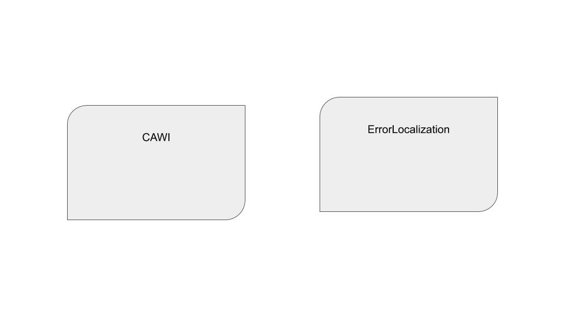

# Scenarios

## Evolution of a system architecture

Each scenario is a possible starting point of the evolution process of a system. Starting off with a basic architecture advancing to more sofisticated.

### Scenario 1 - From disconnected services to connected metadata driven

#### S1 Starting point

We start with two services (CAWI and ErrorLocalization). CAWI is a web based tool for taking surveys. ErrorLocalization is a service that can flag answers as faulty based on a rule set. CAWI knows of ErroLocalization and uses its web-api for validation the answers. Each application har its own set of code lists.  Therefor each service need logic for handling of the codes lists used.

##### CAWI

A web based tool for taking survey answers regarding weather within EU. The datasource for eu countries is a local json-file.
When a survey participant has submitted her response, the outcome of answer validation is printed on the web form. The validation is handled through a web api call to the ErrorLocalization service.

##### ErrorLocalization

Is a service that flags errors in the answer collection.



Code is found here: [Code Scenario 1](./Scenario_1)

``` text
Identified issue

Having duplication of code lists results in added administrative costs with risk of data inconsistency between systems. Resulting in errors and manual labour.
```

#### S1 Goals


To follow principle of metadata driven systems, we see that each of the two services needs to manage the same meta data. By extracting this function we can make each service be more accomodated towards single responsibility. Thus lowering the manual labour keeping two systems up to date with the same data.

#### S1 Thought process

By extracting the handling of metadata to separate service we create a single point of thruth regarding data consistency.

#### S1 Result

Having a disconnected state of applications the manual labour to keep data up to date is high. The risk of poor data integrity is high. By extracting logic of manupilating the codelist metadata we have lowered the cost of keeping data up to date. We have now a masterdata repository who is owner of its data.

### Scenario 2 - Context Aware

`TBC`
We have the three services CAWI, CodeList, and ErrorLoc but we have identified they use the same meta information in some regard. The dupication of information is therefore a fact. By making the services context aware we can extract logic regarding setting up dupicate meta information in the applications.


#### S2 Starting point

We start off by having three services; CAWI, CodeList and ErrorLoc as described above. However each service is defined for a specific statistical program, therefor a few implementations of similar services starts to pop up with the similar implementations.

#### S2 Goals

By extracting a service for handling meta data regarding Statistical programs we can minimize the duplication of manual setup within each service.

### Scenario 3 - Revisiting integration pattern


#### S3 Starting point

### Scenario 4 - Containers, multiple environments


### Scenario 5, Design driven information flow

